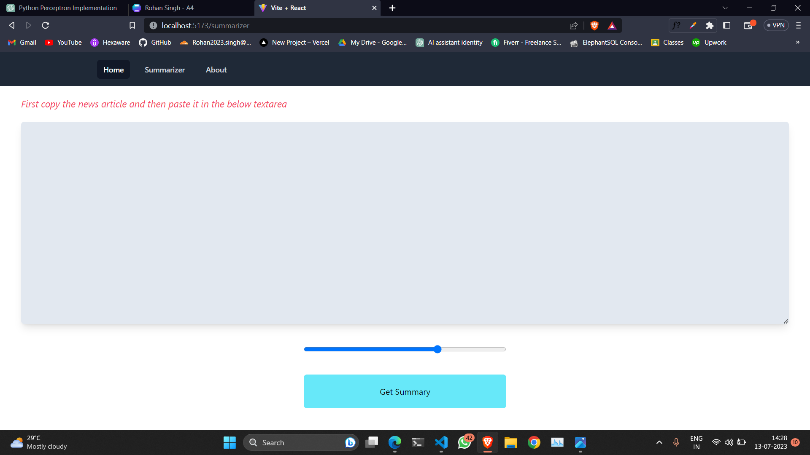
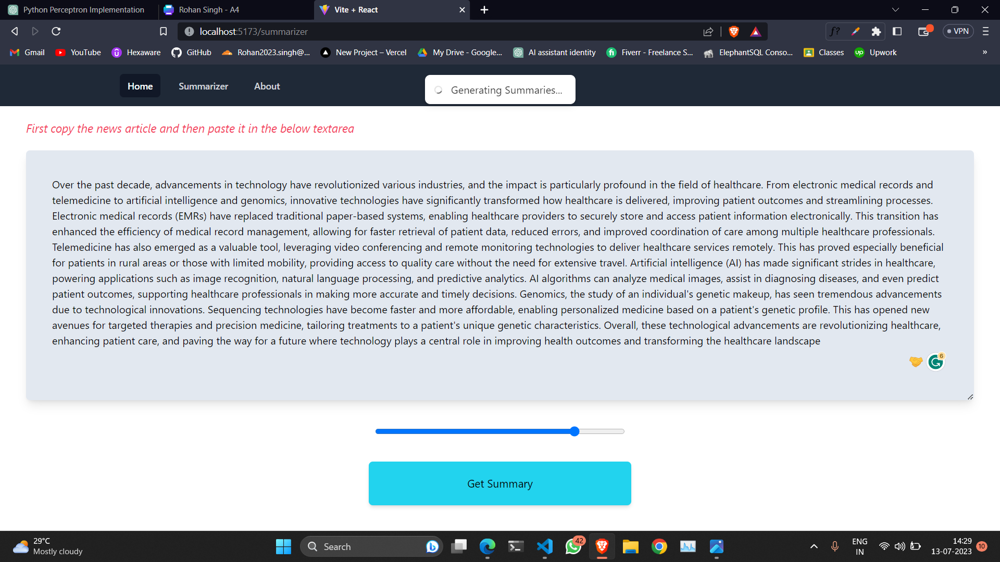
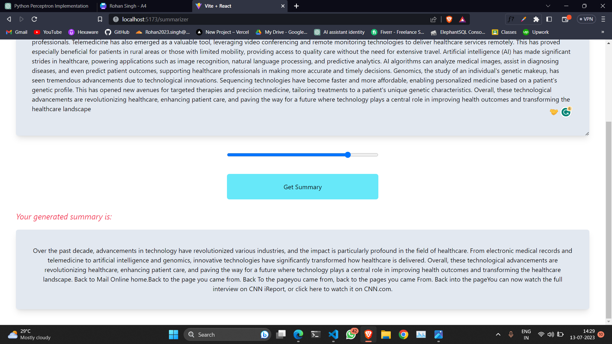

### About

It is a website where users can enter their articles and it will summarize the text of the desired length
We've used the following Tech Stack:
- Frontend: React + TailwindCSS,
- Backend: Flask,
- ML Algorithm: FaceBook's BART,
- Testing: Vitest, React-Testing Library,
- CI/CD: GitHub Actions

### How to use

Install all the dependencies using:

First go to server:

```bash
pip install -r requirements.txt
```

```bash
python app.py
```

Then go to client:

```bash
npm i
```

```bash
npm run dev
```

Some previews






